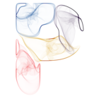

<!-- README.md is generated from README.Rmd. Please edit that file -->

```{r, include=FALSE}
knitr::opts_chunk$set(
  collapse = TRUE,
  comment = "#>",
  fig.path = "man/figures/README-",
  ffmpeg.format='gif',
  interval = 1/15
)
```

# particles 

<!-- badges: start -->
[](https://github.com/thomasp85/particles/actions/workflows/R-CMD-check.yaml)
[](https://codecov.io/gh/thomasp85/particles?branch=main)
[](https://CRAN.R-project.org/package=particles)
[](https://CRAN.R-project.org/package=particles)
<!-- badges: end -->

This package implements the [d3-force](https://github.com/d3/d3-force) algorithm 
developed by Mike Bostock in R, thus providing a way to run many types of 
particle simulations using its versatile interface.

While the first goal is to provide feature parity with its JavaScript origin, 
the intentions is to add more forces, constraints, etc. down the line. While
d3-force is most well-known as a layout engine for visualising networks, it is
capable of much more. Therefore, `particles` is provided as a very open 
framework to play with. Eventually [`ggraph`](https://github.com/thomasp85/ggraph)
will provide some shortcut layouts based on `particles` with the aim of 
facilitating network visualisation.

## Usage
`particles` builds upon the framework provided by [`tidygraph`](https://github.com/thomasp85/tidygraph)
and adds a set of verbs that defines the simulation:

* `simulate()` : Creates a simulation based on the input graph, global 
  parameters, and a genesis function that sets up the initial conditions of the
  simulation.
* `wield()` : Adds a force to the simulation. All forces implemented in d3-force
  are available as well as some additionals.
* `impose()` : Adds a constraint to the simulation. This function is a departure
  from d3-force, as d3-force only allowed for simple fixing of x and/or y 
  coordinates through the use of the fx and fy accessors. `particles` formalises
  the use of simulation constraints and adds new functionalities.
* `evolve()` : Progresses the simulation, either a predefined number of steps, 
  or until the simulated annealing has cooled down.

### Example
A recreation of the Les Miserable network in <https://bl.ocks.org/mbostock/4062045>

```{r, message=FALSE, warning=FALSE}
library(tidyverse)
library(ggraph)
library(tidygraph)
library(particles)
```

```{r}

# Data preparation
d3_col <- c(
  '0' = "#98df8a",
  '1' = "#1f77b4",
  '2' = "#aec7e8",
  '3' = "#ff7f0e",
  '4' = "#ffbb78",
  '5' = "#2ca02c",
  '6' = "#d62728",
  '7' = "#ff9896",
  '8' = "#9467bd",
  '9' = "#c5b0d5",
  '10' =  "#8c564b"
)

raw_data <- 'https://gist.githubusercontent.com/mbostock/4062045/raw/5916d145c8c048a6e3086915a6be464467391c62/miserables.json'
miserable_data <- jsonlite::read_json(raw_data, simplifyVector = TRUE)
miserable_data$nodes$group <- as.factor(miserable_data$nodes$group)
miserable_data$links <- miserable_data$links %>% 
  mutate(from = match(source, miserable_data$nodes$id),
         to = match(target, miserable_data$nodes$id))

# Actual particles part
mis_graph <- miserable_data %>% 
  simulate() %>% 
  wield(link_force) %>% 
  wield(manybody_force) %>% 
  wield(center_force) %>% 
  evolve() %>% 
  as_tbl_graph()

# Plotting with ggraph
ggraph(mis_graph, 'nicely') + 
  geom_edge_link(aes(width = sqrt(value)), colour = '#999999', alpha = 0.6) + 
  geom_node_point(aes(fill = group), shape = 21, colour = 'white', size = 4, 
                  stroke = 1.5) + 
  scale_fill_manual('Group', values = d3_col) + 
  scale_edge_width('Value', range = c(0.5, 3)) + 
  coord_fixed() +
  theme_graph()
```

If you intend to follow the steps of the simulation it is possible to attach an
event handler that gets called ofter each generation of the simulation. If the
handler produces a plot the result will be an animation of the simulation:

```{r, eval=FALSE}
# Random overlapping circles
graph <- as_tbl_graph(igraph::erdos.renyi.game(100, 0)) %>% 
  mutate(x = runif(100) - 0.5, 
         y = runif(100) - 0.5, 
         radius = runif(100, min = 0.1, 0.2))

# Plotting function
graph_plot <- . %>% {
  gr <- as_tbl_graph(.)
  p <- ggraph(gr, layout = as_tibble(gr)) +
    geom_node_circle(aes(r = radius), fill = 'forestgreen', alpha = 0.5) + 
    coord_fixed(xlim = c(-2.5, 2.5), ylim = c(-2.5, 2.5)) + 
    theme_graph()
  plot(p)
}

# Simulation
graph %>% simulate(velocity_decay = 0.7, setup = predefined_genesis(x, y)) %>% 
  wield(collision_force, radius = radius, n_iter = 2) %>% 
  wield(x_force, x = 0, strength = 0.002) %>% 
  wield(y_force, y = 0, strength = 0.002) %>% 
  evolve(on_generation = graph_plot)
```

[Click here for resulting animation](https://www.dropbox.com/s/c5fta49hk53ku0g/bubbles.gif?raw=1)
(GitHub don't allow big gifs in readme)

## Installation

You can install particles from CRAN using `install.packages("particles")` or 
alternatively install the development version from github with:

```{r gh-installation, eval = FALSE}
# install.packages("devtools")
devtools::install_github("thomasp85/particles")
```

## Immense Thanks
* A huge "Thank You" to Mike Bostock is in place. Without d3-force, `particles`
  wouldn't exist and without d3 in general the world would be a sadder place.
* The C++ quad tree implementation that powers `manbody_force` and 
  `collision_force` is a modification of the [implementation made by Andrei Kashcha](https://github.com/anvaka/quadtree.cc) 
  and made available under MIT license. Big thanks to Andrei as well.
